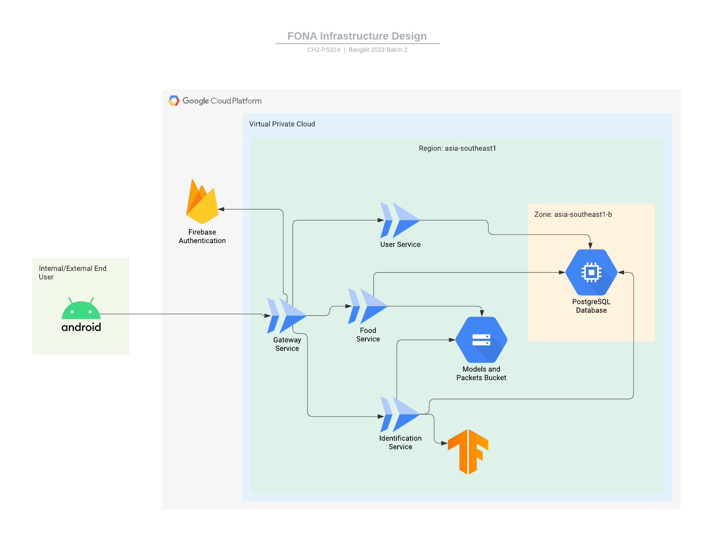

# FONA: Food Nutrition Assistant

> Based on the **Global Nutrition Report 2018**, **Indonesia** was one of the 17 countries with three **nutritional problems** (stunting, wasting, and overweight). In **Indonesia**, many people **have not yet** adopted the **habit of understanding AKG (Angka Kecukupan Gizi)**. Knowing the contribution of food or drink to **daily nutritional needs** can prevent us from the **risk of malnutrition or disease**, especially those caused by **inaccurate nutritional intake** from day-to-day food and drinks. Therefore, how can people **calculate the calorie and nutritional** composition of what they eat? How can they ensure that the foods have their **daily AKG needs**? These problems led us to build an application that lets users know how many **nutrition and calories are in the foods** and give **food recommendations** to help user reaches AKG. We aim to **improve people's health** by paying attention to their diet by **calculating the nutritional composition of the foods** they consume and **giving cuisine recommendations** based on user preferences.

> We need **nutrition** for our body, but we rarely know **how much nutrition and what foods** can fulfill them. According to that situation, the problem is **how to calculate the nutrition of foods** that our body needs. The **solution** is to help other people to **organize their diet** to their **ideal body nutrition needs**. Our idea is to make an Android-based application with a machine learning model to **calculate how much nutrition** the user needs and give a **recommendation** about what **foods with nutrition** that is suitable for the user.

---

## Features

- Allows users to take a picture of their food and then calculate its nutritional content.
- Allows users to track their nutritional needs.
- Provides food suggestions to help fulfill their nutritional requirements.

---

## Application Demonstration

- TBC

---

## Infrastructure Design

---

## Deployment Strategies

- TBC

---

## API Documentation
> https://bit.ly/fona-api-documentation

---

## FONA Github
> https://github.com/FONA-Food-Nutrition-Assistant

---
